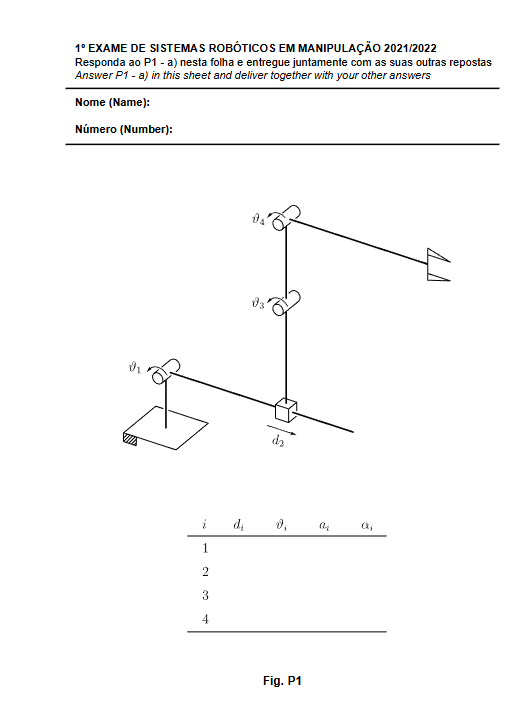
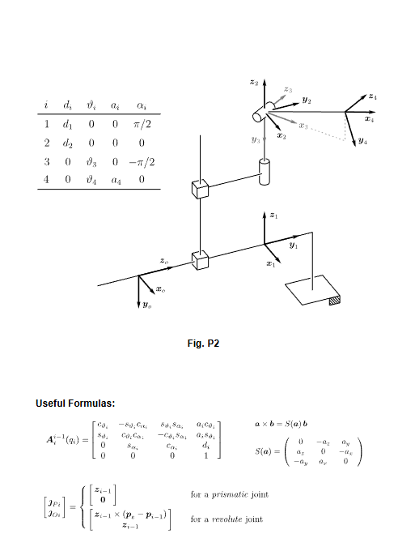
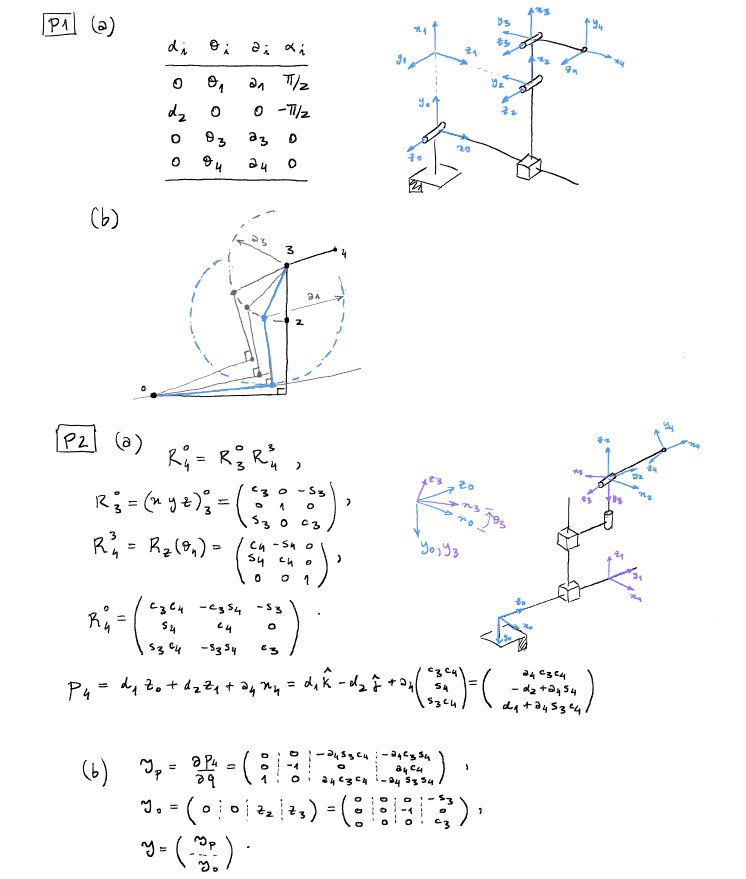
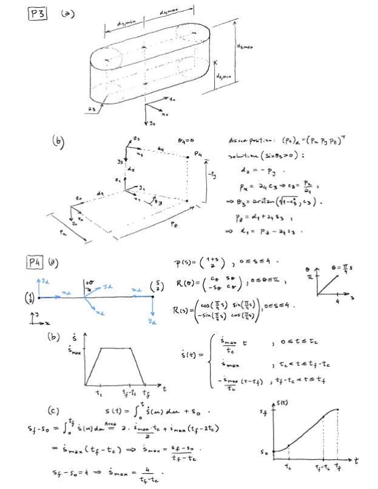
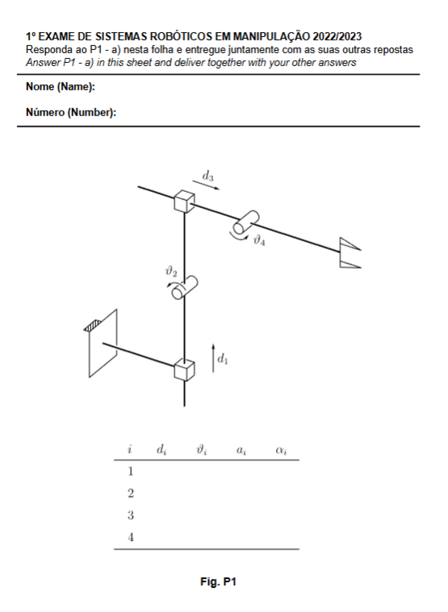
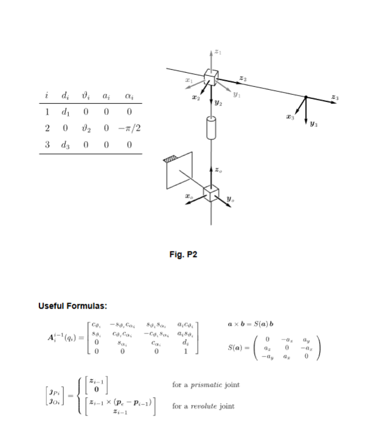
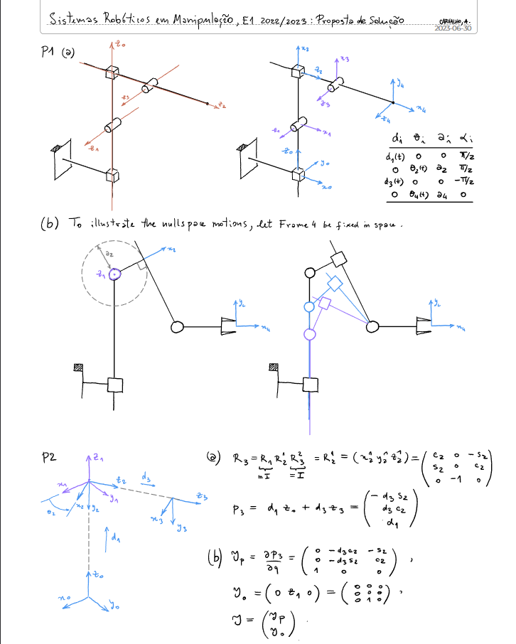
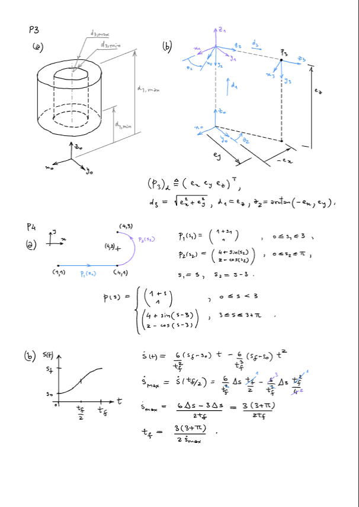

# Robotic Systems in Manipulation (Sistemas Robóticos em Manipulação)
## Comprehensive Study Guide & Exam Solutions

Welcome to this comprehensive study guide for **Robotic Systems in Manipulation**. This guide is designed to help you master the key concepts of manipulator kinematics and trajectory planning. It covers the four exams in the repository step-by-step:
*   **Academic Year 2021/2022 - Exam 1 (E1)**
*   **Academic Year 2021/2022 - Exam 2 (E2)**
*   **Academic Year 2022/2023 - Exam 1 (E1)**
*   **Academic Year 2022/2023 - Exam 2 (E2)**

Every calculation is laid out with complete, step-by-step derivations, beginner-friendly explanations of the underlying logic, and visual aids (diagrams) to clarify coordinate frame placements, workspace boundaries, and trajectory time laws.

---

## 1. Quick Reference: Core Concepts & Conventions

Before diving into the exam problems, here is a summary of the fundamental formulas and methodologies taught in the course. These are the exclusive methods used in the lectures, exercises, and exams.

### 1.1 Denavit-Hartenberg (DH) Convention
The Denavit-Hartenberg convention is a systematic way to attach coordinate frames to the links of a manipulator. The transformation from frame $i-1$ to frame $i$ is defined by four parameters:
*   $d_i$: **Joint distance** along $z_{i-1}$ from the origin $O_{i-1}$ to the intersection of $z_{i-1}$ with $x_i$. (Variable if joint $i$ is prismatic).
*   $\vartheta_i$: **Joint angle** around $z_{i-1}$ from $x_{i-1}$ to $x_i$. (Variable if joint $i$ is revolute).
*   $a_i$: **Link length** along $x_i$ from the intersection of $z_{i-1}$ with $x_i$ to the origin $O_i$.
*   $\alpha_i$: **Link twist** angle around $x_i$ from $z_{i-1}$ to $z_i$.

The corresponding **Homogeneous Transformation Matrix** is:
$$
A_i^{i-1}(q_i) = \begin{bmatrix}
\cos\vartheta_i & -\sin\vartheta_i\cos\alpha_i & \sin\vartheta_i\sin\alpha_i & a_i\cos\vartheta_i \\
\sin\vartheta_i & \cos\vartheta_i\cos\alpha_i & -\cos\vartheta_i\sin\alpha_i & a_i\sin\vartheta_i \\
0 & \sin\alpha_i & \cos\alpha_i & d_i \\
0 & 0 & 0 & 1
\end{bmatrix}
$$

*Mobile-Friendly Fallback:*
```text
A_i^{i-1}(q_i) = [  costheta_i   -sintheta_icosalpha_i   sintheta_isinalpha_i    a_icostheta_i  ]
[  sintheta_i   costheta_icosalpha_i    -costheta_isinalpha_i   a_isintheta_i  ]
[  0            sinalpha_i              cosalpha_i              d_i            ]
[  0            0                       0                       1              ]
```


> [!TIP]
> **DH Frame Assignment Rules**:
> 1. Locate the axis of joint rotation/translation for each joint. Set $z_{i-1}$ along this axis.
> 2. The $x_i$ axis must be perpendicular to both $z_{i-1}$ and $z_i$ (along their common normal). If they intersect, $x_i$ points perpendicular to the plane containing $z_{i-1}$ and $z_i$.
> 3. The origin $O_i$ is at the intersection of $z_i$ with $x_i$.
> 4. $y_i$ is determined by the right-hand rule: $y_i = z_i \times x_i$.

### 1.2 Direct Kinematics (Cinemática Direta)
Direct Kinematics computes the end-effector position $p_n^0$ and orientation $R_n^0$ given the joint coordinates $q$.
*   **Orientation**: $R_n^0 = R_1^0(q_1) R_2^1(q_2) \dots R_n^{n-1}(q_n)$, where $R_i^{i-1}$ is the upper-left $3 \times 3$ submatrix of $A_i^{i-1}$.
*   **Position**: Computed by expressing the link vector displacements in the base frame:
    
$$
p_n^0 = \sum_{i=1}^n R_{i-1}^0 p_{i,i-1}^{i-1}
$$

*Mobile-Friendly Fallback:*
```text
p_n^0 = sum_i=1^n R_i-1^0 p_i,i-1^i-1
```

    Alternatively, it is the upper-right $3 \times 1$ column vector of the overall transformation matrix $T_n^0 = A_1^0 A_2^1 \dots A_n^{n-1}$.

### 1.3 Jacobian Matrix (Matriz Jacobiana)
The Jacobian relates joint velocities $\dot{q}$ to end-effector linear velocity $v_e$ and angular velocity $\omega_e$:
$$
J(q) = \begin{bmatrix} J_P \\ J_O \end{bmatrix} \quad \text{where} \quad v_e = J_P \dot{q}, \quad \omega_e = J_O \dot{q}
$$

*Mobile-Friendly Fallback:*
```text
J(q) = [  J_P  ]
[  J_O  ] \quad \text{where} \quad v_e = J_P \dot{q}, \quad \omega_e = J_O \dot{q}
```

For each column $i$ corresponding to joint $i$ with joint variable $q_i$:
*   **If joint $i$ is prismatic (sliding)**:
    
$$
J_{Pi} = z_{i-1}^0, \quad J_{Oi} = \mathbf{0}
$$

*   **If joint $i$ is revolute (rotating)**:
    
$$
J_{Pi} = z_{i-1}^0 \times (p_e^0 - p_{i-1}^0), \quad J_{Oi} = z_{i-1}^0
$$

*Mobile-Friendly Fallback:*
```text
J_Pi = z_i-1^0  x  (p_e^0 - p_i-1^0), \quad J_Oi = z_i-1^0
```

where $z_{i-1}^0$ is the unit vector of axis $z_{i-1}$ expressed in frame 0 (which is the third column of the rotation matrix $R_{i-1}^0$, with $R_0^0 = I_3$), and $p_{i-1}^0$ is the position of the origin of frame $i-1$ in frame 0.

---

## 2. Exam 2021/2022 - First Exam (1º Exame)

### Problema 1: 4-DOF Planar Manipulator (DH & Null-Space)
Consider the planar robot manipulator shown in Figure P1 of the exam sheet. It has joints: revolute $\vartheta_1$, prismatic $d_2$, revolute $\vartheta_3$, and revolute $\vartheta_4$.



```
         (Joint 4, theta_4)
            O=======O=====> (End Effector)
           / Link 3  a_4
          / Link 2
         / a_3
        O (Joint 3, theta_3)
        |
        | Link 1
        | d_2 (sliding sleeve)
        |
     ===[ ] (Joint 2, prismatic along vertical post)
        |
        O (Joint 1, theta_1)
      [Base]
```

#### a) Frame Placement and Denavit-Hartenberg Table
To assign the frames according to the official solution:
1.  **Frame 0**: Placed at joint 1. The axis of rotation of joint 1 is horizontal (perpendicular to the paper plane). We define $z_0$ along this axis pointing out of the page. We choose $x_0$ to point vertically up, and $y_0$ follows from the right-hand rule.
2.  **Frame 1**: Placed at joint 2. Since joint 2 is prismatic and slides along the post (which is the axis of link 1), we align $z_1$ with this vertical sliding axis pointing upwards. To rotate the old $z_0$ to align with $z_1$ around $x_1$ (which points along the link), we must apply a link twist of $\alpha_1 = \pi/2$ ($90^\circ$).
3.  **Frame 2**: Placed at joint 3. The axis of rotation of joint 3 is horizontal (parallel to $z_0$). To rotate the vertical $z_1$ back to horizontal $z_2$ around the normal $x_2$, we apply a twist of $\alpha_2 = -\pi/2$ (clockwise rotation of $90^\circ$).
4.  **Frame 3**: Placed at joint 4. The axis of rotation of joint 4 is also horizontal. Since $z_2$ and $z_3$ are parallel, the twist is $\alpha_3 = 0$. The distance between them along $x_3$ is the length of link 2 ($a_3$).
5.  **Frame 4**: Placed at the end-effector. The axis $z_4$ is parallel to $z_3$. Thus, $\alpha_4 = 0$, and the displacement is $a_4$.

The resulting DH Parameter Table is:

| $i$ | $d_i$ | $\vartheta_i$ | $a_i$ | $\alpha_i$ |
| :--- | :--- | :--- | :--- | :--- |
| **1** | $0$ | $\vartheta_1$ (Var) | $a_1$ | $\pi/2$ |
| **2** | $d_2$ (Var) | $0$ | $0$ | $-\pi/2$ |
| **3** | $0$ | $\vartheta_3$ (Var) | $a_3$ | $0$ |
| **4** | $0$ | $\vartheta_4$ (Var) | $a_4$ | $0$ |

#### Step-by-Step Parameter Derivation (How each value is obtained)

Here is the detailed explanation for each row and column in the DH table based on **Figure P1**:

*   **Link 1 (Row 1 - Joint 1)**:
    *   $d_1 = 0$: The distance along $z_0$ (which points horizontally out of the page) from the base origin $O_0$ to the intersection of $z_0$ with the common normal $x_1$ is $0$, because the vertical axis $x_1$ intersects the horizontal axis $z_0$ exactly at the base origin $O_0$.
    *   $\vartheta_1$ (Variable): Joint 1 is a revolute joint, so the angle around the $z_0$ axis from the reference axis $x_0$ to $x_1$ is the active joint variable $\vartheta_1$.
    *   $a_1$: The distance along $x_1$ (which points vertically up along the first link/post) from the base origin $O_0$ to the top of the post $O_1$ is the physical height of the first vertical post ($a_1$).
    *   $\alpha_1 = \pi/2$: The twist angle around $x_1$ (vertical, up) to align the $z_0$ axis (out of the page) with the $z_1$ axis (pointing to the right along the sliding guide). Using the right-hand rule with the thumb pointing up along $x_1$, a $+90^\circ$ ($\pi/2$ rad) counterclockwise rotation aligns them.

*   **Link 2 (Row 2 - Joint 2)**:
    *   $d_2$ (Variable): Joint 2 is a prismatic joint sliding along the guide. The distance along $z_1$ (pointing to the right along the guide) from $O_1$ to the intersection with $x_2$ (vertical, pointing up at the collar) is the variable sliding displacement $d_2$.
    *   $\vartheta_2 = 0$: Since Joint 2 is prismatic and does not rotate, the angle of rotation around $z_1$ to align $x_1$ (vertical, up) with $x_2$ (vertical, up) is fixed at $0$.
    *   $a_2 = 0$: The distance along $x_2$ from the intersection of $z_1$ and $x_2$ (which is at the collar $O_2$) to $O_2$ is $0$, because the origin of frame 2 is placed directly on the guide.
    *   $\alpha_2 = -\pi/2$: The twist angle around $x_2$ (vertical, up) to align $z_1$ (pointing to the right) with the axis of Joint 3 ($z_2$, pointing out of the page). Using the right-hand rule with the thumb pointing up along $x_2$, a clockwise rotation of $90^\circ$ ($-\pi/2$ rad) aligns them.

*   **Link 3 (Row 3 - Joint 3)**:
    *   $d_3 = 0$: The distance along the $z_2$ axis (out of the page) from $O_2$ to the intersection with $x_3$ is $0$, as there is no offset along this horizontal joint axis.
    *   $\vartheta_3$ (Variable): Joint 3 is a revolute joint, so the angle around the $z_2$ axis from $x_2$ to $x_3$ is the active joint variable $\vartheta_3$.
    *   $a_3$: The distance along $x_3$ (which points along the link connecting Joint 3 and Joint 4) from Joint 3 to Joint 4 is the physical length of the vertical link 2 ($a_3$).
    *   $\alpha_3 = 0$: The axes of Joint 3 ($z_2$) and Joint 4 ($z_3$) are parallel (both point out of the page), so no twist is needed ($\alpha_3 = 0$).

*   **Link 4 (Row 4 - Joint 4)**:
    *   $d_4 = 0$: No offset along the $z_3$ axis, so $d_4 = 0$.
    *   $\vartheta_4$ (Variable): Joint 4 is a revolute joint, so the angle around the $z_3$ axis from $x_3$ to $x_4$ is the active joint variable $\vartheta_4$.
    *   $a_4$: The distance along $x_4$ (pointing horizontally to the right along the third link) from Joint 4 to the end-effector tip is the physical length of link 3 ($a_4$).
    *   $\alpha_4 = 0$: The end-effector axis $z_4$ is parallel to $z_3$ (both point out of the page), so no twist is needed ($\alpha_4 = 0$).

#### b) Null-Space Motion Sketch
A redundant manipulator has more degrees of freedom than required to specify the task. For a planar task, 3 DOFs are needed. Since this manipulator has 4 DOFs ($\vartheta_1, d_2, \vartheta_3, \vartheta_4$), it is redundant.
*   **Null-Space Motion** (Movimento de Espaço-Nulo) occurs when the joints move without changing the end-effector's position/orientation.
*   If we fix the end-effector (Frame 4) in space, Joint 3 ($\vartheta_3$) must lie on a circle of radius $a_4$ centered at the end-effector position.
*   At the same time, because joint 2 is prismatic along link 1, the path of joint 3 is restricted to the line representing link 1 (at angle $\vartheta_1$).
*   Therefore, the null-space motion is represented by the intersection of the line (link 1) and the circle (centered at the end-effector):

```
                     Circle of radius a_4 centered at EE
                           . - - - .
                       .  /    |    \ .
                      /  /     |     \ \
                     (  (    Joint 3  ) ) <--- Joint 3 can slide along link 1
                      \  \     |     / /       while staying on this circle
                       .  \    |    / .
                           . - - - .
                               |
                           [Link 1] (at angle theta_1)
                               |
                            [Base]
```
As joint 1 rotates ($\vartheta_1$), the prismatic joint $d_2$ changes length so that Joint 3 slides along the circle centered at the fixed end-effector.

---

### Problema 2: 3D Manipulator Direct Kinematics & Jacobian
Consider the manipulator in Figure P2. The DH table is given:



| $i$ | $d_i$ | $\vartheta_i$ | $a_i$ | $\alpha_i$ |
| :--- | :--- | :--- | :--- | :--- |
| **1** | $d_1$ (Var) | $0$ | $0$ | $\pi/2$ |
| **2** | $d_2$ (Var) | $0$ | $0$ | $0$ |
| **3** | $0$ | $\vartheta_3$ (Var) | $0$ | $-\pi/2$ |
| **4** | $0$ | $\vartheta_4$ (Var) | $a_4$ | $0$ |

#### a) Determine Direct Kinematics ($R_4^0$ and $p_4$)
##### 1. Orientation Matrix $R_4^0$
Using the DH parameters, we compute the individual rotation matrices $R_i^{i-1}$ using the standard formula $R_i^{i-1} = R_z(\vartheta_i) R_x(\alpha_i)$:

*   **For Link 1** ($\vartheta_1 = 0$, $\alpha_1 = \pi/2$):
    
$$
R_1^0 = R_z(0) R_x(\pi/2) = I_3 \begin{bmatrix} 1 & 0 & 0 \\ 0 & 0 & -1 \\ 0 & 1 & 0 \end{bmatrix} = \begin{bmatrix} 1 & 0 & 0 \\ 0 & 0 & -1 \\ 0 & 1 & 0 \end{bmatrix}
$$

*Mobile-Friendly Fallback:*
```text
R_1^0 = R_z(0) R_x(\pi/2) = I_3 [  1   0   0   ]
[  0   0   -1  ]
[  0   1   0   ] = [  1   0   0   ]
[  0   0   -1  ]
[  0   1   0   ]
```

*   **For Link 2** ($\vartheta_2 = 0$, $\alpha_2 = 0$):
    
$$
R_2^1 = R_z(0) R_x(0) = I_3 = \begin{bmatrix} 1 & 0 & 0 \\ 0 & 1 & 0 \\ 0 & 0 & 1 \end{bmatrix}
$$

*Mobile-Friendly Fallback:*
```text
R_2^1 = R_z(0) R_x(0) = I_3 = [  1   0   0  ]
[  0   1   0  ]
[  0   0   1  ]
```

*   **For Link 3** ($\vartheta_3$ is variable, $\alpha_3 = -\pi/2$):
    
$$
R_3^2 = R_z(\vartheta_3) R_x(-\pi/2) = \begin{bmatrix} \cos\vartheta_3 & -\sin\vartheta_3 & 0 \\ \sin\vartheta_3 & \cos\vartheta_3 & 0 \\ 0 & 0 & 1 \end{bmatrix} \begin{bmatrix} 1 & 0 & 0 \\ 0 & 0 & 1 \\ 0 & -1 & 0 \end{bmatrix} = \begin{bmatrix} \cos\vartheta_3 & 0 & -\sin\vartheta_3 \\ \sin\vartheta_3 & 0 & \cos\vartheta_3 \\ 0 & -1 & 0 \end{bmatrix}
$$

*Mobile-Friendly Fallback:*
```text
R_3^2 = R_z(\vartheta_3) R_x(-\pi/2) = [  costheta_3   -sintheta_3   0  ]
[  sintheta_3   costheta_3    0  ]
[  0            0             1  ] [  1   0    0  ]
[  0   0    1  ]
[  0   -1   0  ] = [  costheta_3   0    -sintheta_3  ]
[  sintheta_3   0    costheta_3   ]
[  0            -1   0            ]
```

*   **For Link 4** ($\vartheta_4$ is variable, $\alpha_4 = 0$):
    
$$
R_4^3 = R_z(\vartheta_4) R_x(0) = \begin{bmatrix} \cos\vartheta_4 & -\sin\vartheta_4 & 0 \\ \sin\vartheta_4 & \cos\vartheta_4 & 0 \\ 0 & 0 & 1 \end{bmatrix}
$$

*Mobile-Friendly Fallback:*
```text
R_4^3 = R_z(\vartheta_4) R_x(0) = [  costheta_4   -sintheta_4   0  ]
[  sintheta_4   costheta_4    0  ]
[  0            0             1  ]
```


Now multiply them sequentially step-by-step:

1.  **First step: Multiply $R_1^0 R_2^1$ to get $R_2^0$**
    
$$
R_2^0 = R_1^0 \cdot I_3 = \begin{bmatrix} 1 & 0 & 0 \\ 0 & 0 & -1 \\ 0 & 1 & 0 \end{bmatrix}
$$

*Mobile-Friendly Fallback:*
```text
R_2^0 = R_1^0 \cdot I_3 = [  1   0   0   ]
[  0   0   -1  ]
[  0   1   0   ]
```

2.  **Second step: Multiply $R_2^0 R_3^2$ to get $R_3^0$**
    
$$
R_3^0 = \begin{bmatrix} 1 & 0 & 0 \\ 0 & 0 & -1 \\ 0 & 1 & 0 \end{bmatrix} \begin{bmatrix} c_3 & 0 & -s_3 \\ s_3 & 0 & c_3 \\ 0 & -1 & 0 \end{bmatrix}
$$

*Mobile-Friendly Fallback:*
```text
R_3^0 = [  1   0   0   ]
[  0   0   -1  ]
[  0   1   0   ] [  c_3   0    -s_3  ]
[  s_3   0    c_3   ]
[  0     -1   0     ]
```

    Let's compute each column of the resulting matrix $R_3^0$ step-by-step:
    *   **Column 1**:
        
$$
\begin{bmatrix} 1 & 0 & 0 \\ 0 & 0 & -1 \\ 0 & 1 & 0 \end{bmatrix} \begin{bmatrix} c_3 \\ s_3 \\ 0 \end{bmatrix} = \begin{bmatrix} (1)(c_3) + (0)(s_3) + (0)(0) \\ (0)(c_3) + (0)(s_3) + (-1)(0) \\ (0)(c_3) + (1)(s_3) + (0)(0) \end{bmatrix} = \begin{bmatrix} c_3 \\ 0 \\ s_3 \end{bmatrix}
$$

*Mobile-Friendly Fallback:*
```text
[  1   0   0   ]
[  0   0   -1  ]
[  0   1   0   ] [  c_3  ]
[  s_3  ]
[  0    ] = [  (1)(c_3) + (0)(s_3) + (0)(0)   ]
[  (0)(c_3) + (0)(s_3) + (-1)(0)  ]
[  (0)(c_3) + (1)(s_3) + (0)(0)   ] = [  c_3  ]
[  0    ]
[  s_3  ]
```

    *   **Column 2**:
        
$$
\begin{bmatrix} 1 & 0 & 0 \\ 0 & 0 & -1 \\ 0 & 1 & 0 \end{bmatrix} \begin{bmatrix} 0 \\ 0 \\ -1 \end{bmatrix} = \begin{bmatrix} (1)(0) + (0)(0) + (0)(-1) \\ (0)(0) + (0)(0) + (-1)(-1) \\ (0)(0) + (1)(0) + (0)(-1) \end{bmatrix} = \begin{bmatrix} 0 \\ 1 \\ 0 \end{bmatrix}
$$

*Mobile-Friendly Fallback:*
```text
[  1   0   0   ]
[  0   0   -1  ]
[  0   1   0   ] [  0   ]
[  0   ]
[  -1  ] = [  (1)(0) + (0)(0) + (0)(-1)   ]
[  (0)(0) + (0)(0) + (-1)(-1)  ]
[  (0)(0) + (1)(0) + (0)(-1)   ] = [  0  ]
[  1  ]
[  0  ]
```

    *   **Column 3**:
        
$$
\begin{bmatrix} 1 & 0 & 0 \\ 0 & 0 & -1 \\ 0 & 1 & 0 \end{bmatrix} \begin{bmatrix} -s_3 \\ c_3 \\ 0 \end{bmatrix} = \begin{bmatrix} (1)(-s_3) + (0)(c_3) + (0)(0) \\ (0)(-s_3) + (0)(c_3) + (-1)(0) \\ (0)(-s_3) + (1)(c_3) + (0)(0) \end{bmatrix} = \begin{bmatrix} -s_3 \\ 0 \\ c_3 \end{bmatrix}
$$

*Mobile-Friendly Fallback:*
```text
[  1   0   0   ]
[  0   0   -1  ]
[  0   1   0   ] [  -s_3  ]
[  c_3   ]
[  0     ] = [  (1)(-s_3) + (0)(c_3) + (0)(0)   ]
[  (0)(-s_3) + (0)(c_3) + (-1)(0)  ]
[  (0)(-s_3) + (1)(c_3) + (0)(0)   ] = [  -s_3  ]
[  0     ]
[  c_3   ]
```

    *   This gives:
        
$$
R_3^0 = \begin{bmatrix} c_3 & 0 & -s_3 \\ 0 & 1 & 0 \\ s_3 & 0 & c_3 \end{bmatrix}
$$

*Mobile-Friendly Fallback:*
```text
R_3^0 = [  c_3   0   -s_3  ]
[  0     1   0     ]
[  s_3   0   c_3   ]
```

    *   *Alternative Geometric Method (as shown in the official handwritten solution)*:
        Since Joint 1 and Joint 2 are prismatic (no rotation), the orientation of Frame 2 remains fixed relative to Frame 0. The first rotation occurs at Joint 3 around the horizontal axis $y_0$ (pointing out of the page). Thus, Frame 3 is rotated relative to Frame 0 by $\vartheta_3$ around the $y$-axis:
        
$$
R_3^0 = R_y(\vartheta_3) = \begin{bmatrix} \cos\vartheta_3 & 0 & -\sin\vartheta_3 \\ 0 & 1 & 0 \\ \sin\vartheta_3 & 0 & \cos\vartheta_3 \end{bmatrix}
$$

*Mobile-Friendly Fallback:*
```text
R_3^0 = R_y(\vartheta_3) = [  costheta_3   0   -sintheta_3  ]
[  0            1   0            ]
[  sintheta_3   0   costheta_3   ]
```

        
        **How this specific matrix is derived (Geometric & Sign Swap Analysis)**:
        *   **Geometric Projection**: The rotation matrix columns represent the unit vectors of Frame 3 ($\mathbf{x}_3, \mathbf{y}_3, \mathbf{z}_3$) projected onto Frame 0 ($\mathbf{x}_0, \mathbf{y}_0, \mathbf{z}_0$).
            *   $\mathbf{y}_3$ is parallel to $\mathbf{y}_0$ (pointing out of the page), so its column is $[0, 1, 0]^T$.
            *   As Joint 3 rotates by $\vartheta_3$, $\mathbf{x}_3$ tilts upwards towards $+\mathbf{z}_0$, giving $\mathbf{x}_3^0 = [\cos\vartheta_3, 0, \sin\vartheta_3]^T$.
            *   Simultaneously, $\mathbf{z}_3$ tilts leftwards towards $-\mathbf{x}_0$, giving $\mathbf{z}_3^0 = [-\sin\vartheta_3, 0, \cos\vartheta_3]^T$.
            *   Putting these columns together yields the matrix.
        *   **Right-Hand Rule Sign Swap**: The standard rotation matrix around the $y$-axis has the negative sign on the bottom-left ($-\sin\beta$) because standard coordinates assume the $+y$-axis points *into* the page. Here, $+\mathbf{y}_0$ points *out of* the page. By the right-hand rule, this reverses the positive rotation direction (now going from $+\mathbf{x}_0$ to $+\mathbf{z}_0$), which swaps the signs of the $\sin\vartheta_3$ terms (effectively replacing $\beta$ with $-\beta$).
        
        Both the standard DH multiplication and the direct geometric interpretation are 100% equivalent.

3.  **Third step: Multiply $R_3^0 R_4^3$ to get $R_4^0$**
    
$$
R_4^0 = \begin{bmatrix} c_3 & 0 & -s_3 \\ 0 & 1 & 0 \\ s_3 & 0 & c_3 \end{bmatrix} \begin{bmatrix} c_4 & -s_4 & 0 \\ s_4 & c_4 & 0 \\ 0 & 0 & 1 \end{bmatrix}
$$

*Mobile-Friendly Fallback:*
```text
R_4^0 = [  c_3   0   -s_3  ]
[  0     1   0     ]
[  s_3   0   c_3   ] [  c_4   -s_4   0  ]
[  s_4   c_4    0  ]
[  0     0      1  ]
```

    *   Row 1:
        *   Col 1: $(c_3)(c_4) + (0)(s_4) + (-s_3)(0) = c_3 c_4$
        *   Col 2: $(c_3)(-s_4) + (0)(c_4) + (-s_3)(0) = -c_3 s_4$
        *   Col 3: $(c_3)(0) + (0)(0) + (-s_3)(1) = -s_3$
    *   Row 2:
        *   Col 1: $(0)(c_4) + (1)(s_4) + (0)(0) = s_4$
        *   Col 2: $(0)(-s_4) + (1)(c_4) + (0)(0) = c_4$
        *   Col 3: $(0)(0) + (1)(0) + (0)(1) = 0$
    *   Row 3:
        *   Col 1: $(s_3)(c_4) + (0)(s_4) + (c_3)(0) = s_3 c_4$
        *   Col 2: $(s_3)(-s_4) + (0)(c_4) + (c_3)(0) = -s_3 s_4$
        *   Col 3: $(s_3)(0) + (0)(0) + (c_3)(1) = c_3$
    Thus:
    
$$
R_4^0 = \begin{bmatrix} c_3 c_4 & -c_3 s_4 & -s_3 \\ s_4 & c_4 & 0 \\ s_3 c_4 & -s_3 s_4 & c_3 \end{bmatrix}
$$

*Mobile-Friendly Fallback:*
```text
R_4^0 = [  c_3 c_4   -c_3 s_4   -s_3  ]
[  s_4       c_4        0     ]
[  s_3 c_4   -s_3 s_4   c_3   ]
```


##### 2. Position Vector $p_4$
To find the position of the end-effector tip relative to the base, we trace the path from the base origin $O_0$ to the end-effector origin $O_4$, adding up the vector displacement of each link step-by-step:
1.  **First Step (along $z_0$)**: We slide along the first joint axis $z_0$ by a variable distance $d_1$. This vector is **$d_1 z_0$**.
2.  **Second Step (along $z_1$)**: From there, we slide along the second joint axis $z_1$ (which points along the horizontal guide rail) by a variable distance $d_2$. This vector is **$d_2 z_1$**.
3.  **Third Step (along $x_4$)**: Finally, from the collar, we trace the remaining link lengths. Since $a_1=0, a_2=0, a_3=0$, the only physical link length is the final link 4. This link lies along the final $x_4$ axis and has length $a_4$. This vector is **$a_4 x_4$**.

Adding these steps together gives the position equation:
$$
p_4 = d_1 z_0 + d_2 z_1 + a_4 x_4
$$


To compute the final coordinate coordinates mathematically, we must express all three unit vectors ($z_0, z_1, x_4$) in the base coordinate system (Frame 0):
*   $z_0$ is already in Frame 0:
    
$$
z_0^0 = \begin{bmatrix} 0 \\ 0 \\ 1 \end{bmatrix}
$$

*Mobile-Friendly Fallback:*
```text
z_0^0 = [  0  ]
[  0  ]
[  1  ]
```

*   $z_1$ is the third column of the rotation matrix $R_1^0$:
    
$$
z_1^0 = R_1^0 \begin{bmatrix} 0 \\ 0 \\ 1 \end{bmatrix} = \begin{bmatrix} 1 & 0 & 0 \\ 0 & 0 & -1 \\ 0 & 1 & 0 \end{bmatrix} \begin{bmatrix} 0 \\ 0 \\ 1 \end{bmatrix} = \begin{bmatrix} 0 \\ -1 \\ 0 \end{bmatrix} = -\hat{j}
$$

*Mobile-Friendly Fallback:*
```text
z_1^0 = R_1^0 [  0  ]
[  0  ]
[  1  ] = [  1   0   0   ]
[  0   0   -1  ]
[  0   1   0   ] [  0  ]
[  0  ]
[  1  ] = [  0   ]
[  -1  ]
[  0   ] = -\hat{j}
```

*   $x_4$ is the first column of $R_4^0$:
    
$$
x_4^0 = \begin{bmatrix} c_3 c_4 \\ s_4 \\ s_3 c_4 \end{bmatrix}
$$

*Mobile-Friendly Fallback:*
```text
x_4^0 = [  c_3 c_4  ]
[  s_4      ]
[  s_3 c_4  ]
```

Combine these terms:
$$
p_4 = d_1 \begin{bmatrix} 0 \\ 0 \\ 1 \end{bmatrix} + d_2 \begin{bmatrix} 0 \\ -1 \\ 0 \end{bmatrix} + a_4 \begin{bmatrix} c_3 c_4 \\ s_4 \\ s_3 c_4 \end{bmatrix} = \begin{bmatrix} a_4 c_3 c_4 \\ -d_2 + a_4 s_4 \\ d_1 + a_4 s_3 c_4 \end{bmatrix}
$$

*Mobile-Friendly Fallback:*
```text
p_4 = d_1 [  0  ]
[  0  ]
[  1  ] + d_2 [  0   ]
[  -1  ]
[  0   ] + a_4 [  c_3 c_4  ]
[  s_4      ]
[  s_3 c_4  ] = [  a_4 c_3 c_4        ]
[  -d_2 + a_4 s_4     ]
[  d_1 + a_4 s_3 c_4  ]
```


#### b) Build the Jacobian Matrix $J$
The joint vector is $q = [d_1, d_2, \vartheta_3, \vartheta_4]^T$.
We compute each column of the Jacobian using the formulas:
*   **Column 1 (Prismatic Joint $d_1$)**:
    *   $J_{P1} = z_0 = [0, 0, 1]^T$
    *   $J_{O1} = \mathbf{0} = [0, 0, 0]^T$
*   **Column 2 (Prismatic Joint $d_2$)**:
    *   $J_{P2} = z_1 = [0, -1, 0]^T$
    *   $J_{O2} = \mathbf{0} = [0, 0, 0]^T$
*   **Column 3 (Revolute Joint $\vartheta_3$)**:
    *   $J_{P3} = z_2 \times (p_4 - p_2)$
        Note that $p_2 = d_1 z_0 + d_2 z_1 = [0, -d_2, d_1]^T$. Thus, $p_4 - p_2 = a_4 x_4^0 = [a_4 c_3 c_4, a_4 s_4, a_4 s_3 c_4]^T$.
        The axis $z_2$ is the same as $z_1$, so $z_2 = [0, -1, 0]^T$.
        Let's compute the cross product coordinate-by-coordinate:
        
$$
J_{P3} = \begin{bmatrix} 0 \\ -1 \\ 0 \end{bmatrix} \times \begin{bmatrix} a_4 c_3 c_4 \\ a_4 s_4 \\ a_4 s_3 c_4 \end{bmatrix} = \begin{bmatrix} (-1)(a_4 s_3 c_4) - (0)(a_4 s_4) \\ (0)(a_4 c_3 c_4) - (0)(a_4 s_3 c_4) \\ (0)(a_4 s_4) - (-1)(a_4 c_3 c_4) \end{bmatrix} = \begin{bmatrix} -a_4 s_3 c_4 \\ 0 \\ a_4 c_3 c_4 \end{bmatrix}
$$

*Mobile-Friendly Fallback:*
```text
J_{P3} = [  0   ]
[  -1  ]
[  0   ] \times [  a_4 c_3 c_4  ]
[  a_4 s_4      ]
[  a_4 s_3 c_4  ] = [  (-1)(a_4 s_3 c_4) - (0)(a_4 s_4)     ]
[  (0)(a_4 c_3 c_4) - (0)(a_4 s_3 c_4)  ]
[  (0)(a_4 s_4) - (-1)(a_4 c_3 c_4)     ] = [  -a_4 s_3 c_4  ]
[  0             ]
[  a_4 c_3 c_4   ]
```

    *   $J_{O3} = z_2 = [0, -1, 0]^T$
*   **Column 4 (Revolute Joint $\vartheta_4$)**:
    *   $J_{P4} = z_3 \times (p_4 - p_3)$
        Since the origins of frame 2 and frame 3 are at the same physical point ($a_2=0$), $p_3 = p_2$. Thus $p_4 - p_3 = a_4 x_4^0 = [a_4 c_3 c_4, a_4 s_4, a_4 s_3 c_4]^T$.
        The axis $z_3$ is the third column of $R_3^0$: $z_3 = [-s_3, 0, c_3]^T$.
        Let's compute the cross product coordinate-by-coordinate:
        
$$
J_{P4} = \begin{bmatrix} -s_3 \\ 0 \\ c_3 \end{bmatrix} \times \begin{bmatrix} a_4 c_3 c_4 \\ a_4 s_4 \\ a_4 s_3 c_4 \end{bmatrix} = \begin{bmatrix} (0)(a_4 s_3 c_4) - (c_3)(a_4 s_4) \\ (c_3)(a_4 c_3 c_4) - (-s_3)(a_4 s_3 c_4) \\ (-s_3)(a_4 s_4) - (0)(a_4 c_3 c_4) \end{bmatrix} = \begin{bmatrix} -a_4 c_3 s_4 \\ a_4 c_4(c_3^2 + s_3^2) \\ -a_4 s_3 s_4 \end{bmatrix} = \begin{bmatrix} -a_4 c_3 s_4 \\ a_4 c_4 \\ -a_4 s_3 s_4 \end{bmatrix}
$$

*Mobile-Friendly Fallback:*
```text
J_{P4} = [  -s_3  ]
[  0     ]
[  c_3   ] \times [  a_4 c_3 c_4  ]
[  a_4 s_4      ]
[  a_4 s_3 c_4  ] = [  (0)(a_4 s_3 c_4) - (c_3)(a_4 s_4)         ]
[  (c_3)(a_4 c_3 c_4) - (-s_3)(a_4 s_3 c_4)  ]
[  (-s_3)(a_4 s_4) - (0)(a_4 c_3 c_4)        ] = [  -a_4 c_3 s_4            ]
[  a_4 c_4(c_3^2 + s_3^2)  ]
[  -a_4 s_3 s_4            ] = [  -a_4 c_3 s_4  ]
[  a_4 c_4       ]
[  -a_4 s_3 s_4  ]
```

        *(Note that we used the trigonometric identity $c_3^2 + s_3^2 = 1$ to simplify the $y$-component).*
    *   $J_{O4} = z_3 = [-s_3, 0, c_3]^T$

The complete Jacobian is:
$$
J = \begin{bmatrix}
0 & 0 & -a_4 s_3 c_4 & -a_4 c_3 s_4 \\
0 & -1 & 0 & a_4 c_4 \\
1 & 0 & a_4 c_3 c_4 & -a_4 s_3 s_4 \\
\hline
0 & 0 & 0 & -s_3 \\
0 & 0 & -1 & 0 \\
0 & 0 & 0 & c_3
\end{bmatrix}
$$

*Mobile-Friendly Fallback:*
```text
J = [  0                    0    -a_4 s_3 c_4   -a_4 c_3 s_4  ]
[  0                    -1   0              a_4 c_4       ]
[  1                    0    a_4 c_3 c_4    -a_4 s_3 s_4  ]
[  ----------------
0   0    0              -s_3          ]
[  0                    0    -1             0             ]
[  0                    0    0              c_3           ]
```


#### Reference Solution Visual Aid (Handwritten Solutions Page 1)
Below is the scan of the official handwritten solution for Problems 1 and 2 of this exam:



---

### Problema 3: Workspace & Inverse Kinematics
#### a) Workspace Volume Sketch (for $\vartheta_4 = 0$)
When $\vartheta_4 = 0$, the position simplifies to:
$$
p_4 = \begin{bmatrix} a_4 \cos\vartheta_3 \\ -d_2 \\ d_1 + a_4 \sin\vartheta_3 \end{bmatrix}
$$

*Mobile-Friendly Fallback:*
```text
p_4 = [  a_4 costheta_3        ]
[  -d_2                  ]
[  d_1 + a_4 sintheta_3  ]
```

Let's determine the shape step-by-step by varying one joint parameter at a time while holding the others fixed:

1.  **Step 1: Vary $\vartheta_3$ (revolute joint) with $d_1$ and $d_2$ fixed**
    *   With $d_1$ and $d_2$ constant, the position coordinates are:
        
$$
p_x = a_4 \cos\vartheta_3, \quad p_y = -d_2 \text{ (constant)}, \quad p_z = d_1 + a_4 \sin\vartheta_3
$$

    *   In the $xz$-plane, these equations represent a circle. We can verify this mathematically by rewriting:
        
$$
(p_x)^2 + (p_z - d_1)^2 = (a_4 \cos\vartheta_3)^2 + (a_4 \sin\vartheta_3)^2 = a_4^2(\cos^2\vartheta_3 + \sin^2\vartheta_3) = a_4^2
$$

        which is a **circle of radius $a_4$** centered at $(0, d_1)$ in the $xz$-plane.

2.  **Step 2: Vary $d_1$ (prismatic joint) between its limits $[d_{1,\min}, d_{1,\max}]$**
    *   As the joint slides, the center of our circle $(0, d_1)$ translates along the $z$-axis from $d_{1,\min}$ to $d_{1,\max}$.
    *   The union of all these translated circles forms a **stadium shape** (or "race track" / "capsule" shape) in the $xz$-plane. 
    *   This stadium has a flat rectangular middle section of width $2a_4$ and length $d_{1,\max} - d_{1,\min}$, capped by two semicircles of radius $a_4$ at the ends.

3.  **Step 3: Vary $d_2$ (prismatic joint) between its limits $[d_{2,\min}, d_{2,\max}]$**
    *   Since $p_y = -d_2$, varying $d_2$ translates (extrudes) this entire 2D stadium shape along the $y$-axis (which in the official solution diagram is the vertical axis pointing downwards).
    *   Extruding a stadium shape along a perpendicular axis yields a **stadium-profile prism** (or a flat-sided cylinder).

This yields a stadium-shaped prism extruded along the $y$-axis:

```
                 Z-axis
                   ^
                   |    . - - - .
                   |  /     |     \
                   | |      |      |  } radius = a_4
                   | |      |      |
                   | |<----a_4---->|
                   | |      |      |  } height = d_1,max - d_1,min
                   | |      |      |
                   |  \     |     /
                   |    . - - - .
                   +--------------------> X-axis
                  /
                 / Extruded along Y-axis by (d_2,max - d_2,min)
                v
              Y-axis
```

#### b) Inverse Kinematics
Given desired position $(p_x, p_y, p_z)$, find the joint variables $(d_1, d_2, \vartheta_3)$ assuming $\sin\vartheta_3 > 0$:
1.  **Solve for $d_2$**:
    From the $y$-coordinate equation:
    
$$
p_y = -d_2 \implies d_2 = -p_y
$$

2.  **Solve for $\vartheta_3$**:
    From the $x$-coordinate equation:
    
$$
p_x = a_4 \cos\vartheta_3 \implies \cos\vartheta_3 = \frac{p_x}{a_4}
$$

*Mobile-Friendly Fallback:*
```text
p_x = a_4 costheta_3  =>  costheta_3 = (p_x)/(a_4)
```

    Using the identity $\sin^2\vartheta_3 + \cos^2\vartheta_3 = 1$:
    
$$
\sin\vartheta_3 = \pm\sqrt{1 - \cos^2\vartheta_3} = \pm\sqrt{1 - \left(\frac{p_x}{a_4}\right)^2}
$$

*Mobile-Friendly Fallback:*
```text
sintheta_3 = +/-sqrt(1 - cos^2theta_3) = +/-sqrt(1 - <=ft((p_x)/(a_4))^2)
```

    Since the problem specifies the branch with $\sin\vartheta_3 > 0$, we select the positive sign:
    
$$
\sin\vartheta_3 = \sqrt{1 - \left(\frac{p_x}{a_4}\right)^2}
$$

*Mobile-Friendly Fallback:*
```text
sintheta_3 = sqrt(1 - <=ft((p_x)/(a_4))^2)
```

    Now, use the standard four-quadrant arctangent:
    
$$
\vartheta_3 = \arctan2(\sin\vartheta_3, \cos\vartheta_3) = \arctan\left(\frac{\sqrt{1 - (p_x/a_4)^2}}{p_x/a_4}\right)
$$

*Mobile-Friendly Fallback:*
```text
theta_3 = arctan2(sintheta_3, costheta_3) = arctan<=ft(\fracsqrt(1 - (p_x/a_4)^2)p_x/a_4)
```

3.  **Solve for $d_1$**:
    From the $z$-coordinate equation:
    
$$
p_z = d_1 + a_4 \sin\vartheta_3 \implies d_1 = p_z - a_4 \sin\vartheta_3
$$


---

### Problema 4: Trajectory Planning (Trapezoidal Velocity Profile)
#### a) Parametric Equations for Position and Orientation
The path is a horizontal line of length $S = 4$ starting at $p_i = [1, 2]^T$ and ending at $p_f = [5, 2]^T$. The orientation rotates clockwise by $180^\circ$ ($\pi$ rad).
Let $s \in [0, 4]$ be the path displacement coordinate:
*   **Position**:
    We interpolate linearly between $p_i$ and $p_f$:
    
$$
p(s) = p_i + \frac{s}{S}(p_f - p_i) = \begin{bmatrix} 1 \\ 2 \end{bmatrix} + \frac{s}{4}\begin{bmatrix} 5 - 1 \\ 2 - 2 \end{bmatrix} = \begin{bmatrix} 1 + s \\ 2 \end{bmatrix}
$$

*Mobile-Friendly Fallback:*
```text
p(s) = p_i + \frac{s}{S}(p_f - p_i) = [  1  ]
[  2  ] + \frac{s}{4}[  5 - 1  ]
[  2 - 2  ] = [  1 + s  ]
[  2      ]
```

*   **Orientation**:
    We interpolate the angle $\theta$ linearly from $0$ to $\pi$ based on displacement $s$:
    
$$
\theta(s) = \frac{\pi}{4} s
$$

*Mobile-Friendly Fallback:*
```text
theta(s) = (pi)/(4) s
```

    Since the rotation is clockwise (negative direction in standard coordinates), the orientation matrix $R(s)$ is:
    
$$
R(s) = R_z(-\theta(s)) = \begin{bmatrix} \cos(\frac{\pi}{4}s) & \sin(\frac{\pi}{4}s) & 0 \\ -\sin(\frac{\pi}{4}s) & \cos(\frac{\pi}{4}s) & 0 \\ 0 & 0 & 1 \end{bmatrix}
$$

*Mobile-Friendly Fallback:*
```text
R(s) = R_z(-\theta(s)) = [  cos((pi)/(4)s)    sin((pi)/(4)s)   0  ]
[  -sin((pi)/(4)s)   cos((pi)/(4)s)   0  ]
[  0                 0                1  ]
```

    Restricting to the 2D plane:
    
$$
R(s) = \begin{bmatrix} \cos(\frac{\pi}{4}s) & \sin(\frac{\pi}{4}s) \\ -\sin(\frac{\pi}{4}s) & \cos(\frac{\pi}{4}s) \end{bmatrix}
$$

*Mobile-Friendly Fallback:*
```text
R(s) = [  cos((pi)/(4)s)    sin((pi)/(4)s)  ]
[  -sin((pi)/(4)s)   cos((pi)/(4)s)  ]
```


#### b) Trapezoidal Velocity Profile Parameterization
For a trapezoidal profile $\dot{s}(t)$ with acceleration time $t_c$ and total duration $t_f$:
$$
\dot{s}(t) = \begin{cases}
\frac{\dot{s}_{\max}}{t_c} t & 0 \le t \le t_c \\
\dot{s}_{\max} & t_c < t \le t_f - t_c \\
-\frac{\dot{s}_{\max}}{t_c} (t - t_f) & t_f - t_c < t \le t_f
\end{cases}
$$

*Mobile-Friendly Fallback:*
```text
\dot{s}(t) = {
  \frac\dots_\maxt_c t   if 0 <= t <= t_c
  \dots_\max   if t_c < t <= t_f - t_c
  -\frac\dots_\maxt_c (t - t_f)   if t_f - t_c < t <= t_f
}
```


#### c) Maximum Velocity $\dot{s}_{\max}$
The total displacement is the integral of the velocity over time, which corresponds to the area of the trapezoid:
$$
S = \text{Area} = \frac{\text{top base} + \text{bottom base}}{2} \times \text{height} = \frac{(t_f - 2t_c) + t_f}{2} \dot{s}_{\max} = \dot{s}_{\max}(t_f - t_c)
$$

*Mobile-Friendly Fallback:*
```text
S = \textArea = \frac\texttop base + \textbottom base2  x  \textheight = ((t_f - 2t_c) + t_f)/(2) \dots_\max = \dots_\max(t_f - t_c)
```

Given $S = 4$:
$$
4 = \dot{s}_{\max}(t_f - t_c) \implies \dot{s}_{\max} = \frac{4}{t_f - t_c}
$$

*Mobile-Friendly Fallback:*
```text
4 = \dots_\max(t_f - t_c)  =>  \dots_\max = (4)/(t_f - t_c)
```


To find the displacement curve $s(t)$, we integrate $\dot{s}(t)$ segment-by-segment:
1.  **Acceleration phase ($0 \le t \le t_c$)**:
    
$$
s(t) = \int_0^t \frac{\dot{s}_{\max}}{t_c} u \, du = \frac{\dot{s}_{\max}}{2t_c} t^2
$$

*Mobile-Friendly Fallback:*
```text
s(t) = \int_0^t \frac\dots_\maxt_c u \, du = \frac\dots_\max2t_c t^2
```

2.  **Constant velocity phase ($t_c < t \le t_f - t_c$)**:
    
$$
s(t) = s(t_c) + \int_{t_c}^t \dot{s}_{\max} \, du = \frac{\dot{s}_{\max} t_c}{2} + \dot{s}_{\max}(t - t_c)
$$

*Mobile-Friendly Fallback:*
```text
s(t) = s(t_c) + \int_t_c^t \dots_\max \, du = \frac\dots_\max t_c2 + \dots_\max(t - t_c)
```

3.  **Deceleration phase ($t_f - t_c < t \le t_f$)**:
    
$$
s(t) = 4 - \int_t^{t_f} \left(-\frac{\dot{s}_{\max}}{t_c} (u - t_f)\right) du = 4 - \frac{\dot{s}_{\max}}{2t_c} (t - t_f)^2
$$

*Mobile-Friendly Fallback:*
```text
s(t) = 4 - \int_t^t_f <=ft(-\frac\dots_\maxt_c (u - t_f)) du = 4 - \frac\dots_\max2t_c (t - t_f)^2
```


#### Reference Solution Visual Aid (Handwritten Solutions Page 2)
Below is the scan of the official handwritten solution for Problems 3 and 4 of this exam:



---

## 3. Exam 2021/2022 - Second Exam (2º Exame)

### Problema 1: 4-DOF Planar Manipulator (DH & Singularities)
#### a) DH Frame Placement & Parameters Table
For the planar manipulator in Fig. P1, all joints rotate/slide in the same plane:

| $i$ | $d_i$ | $\vartheta_i$ | $a_i$ | $\alpha_i$ |
| :--- | :--- | :--- | :--- | :--- |
| **1** | $0$ | $\vartheta_1$ (Var) | $a_1$ | $0$ |
| **2** | $d_2$ (Var) | $0$ | $0$ | $0$ |
| **3** | $0$ | $\vartheta_3$ (Var) | $a_3$ | $0$ |
| **4** | $0$ | $\vartheta_4$ (Var) | $a_4$ | $0$ |

#### b) Singularity Configurations
Without calculating the Jacobian, we can find singularities geometrically. For this planar manipulator, a singularity occurs when two links align, causing the manipulator to lose a degree of freedom in the radial direction:
*   **Fully Extended Configuration**: $x_2 \equiv x_3$ (Link 2 and Link 3 are collinear in the same direction).
*   **Fully Folded Configuration**: $x_2 \equiv -x_3$ (Link 3 is folded back over Link 2).

```
   Singularity 1 (Extended):             Singularity 2 (Folded):
   O--------O--------O----> EE           O--------O====# EE
  J1   L1   J2   L2   J3                J1   L1   J2 (L3 folded back)
```

---

### Problema 2: 3-DOF Spatial Manipulator (Direct Kinematics & Jacobian)
#### a) Direct Kinematics ($R_3^0$ and $p_3$)
Given the DH table for Figure P2:

| $i$ | $d_i$ | $\vartheta_i$ | $a_i$ | $\alpha_i$ |
| :--- | :--- | :--- | :--- | :--- |
| **1** | $0$ | $\vartheta_1$ (Var) | $0$ | $-\pi/2$ |
| **2** | $d_2$ (Var) | $0$ | $0$ | $\pi/4$ |
| **3** | $d_3$ (Var) | $0$ | $0$ | $0$ |

##### 1. Orientation Matrix $R_3^0$
Using the DH parameters, we compute the individual rotation matrices:
*   $R_1^0 = R_z(\vartheta_1)R_x(-\pi/2) = \begin{bmatrix} c_1 & 0 & -s_1 \\ s_1 & 0 & c_1 \\ 0 & -1 & 0 \end{bmatrix}$
*   $R_2^1 = R_x(\pi/4) = \begin{bmatrix} 1 & 0 & 0 \\ 0 & \sqrt{2}/2 & -\sqrt{2}/2 \\ 0 & \sqrt{2}/2 & \sqrt{2}/2 \end{bmatrix}$ (since $\theta_2 = 0, \alpha_2 = \pi/4$)
*   $R_3^2 = I_3$ (since $\theta_3 = 0, \alpha_3 = 0$)

Multiply $R_1^0 R_2^1$ step-by-step:
$$
R_3^0 = \begin{bmatrix} c_1 & 0 & -s_1 \\ s_1 & 0 & c_1 \\ 0 & -1 & 0 \end{bmatrix} \begin{bmatrix} 1 & 0 & 0 \\ 0 & \sqrt{2}/2 & -\sqrt{2}/2 \\ 0 & \sqrt{2}/2 & \sqrt{2}/2 \end{bmatrix}
$$

*Mobile-Friendly Fallback:*
```text
R_3^0 = [  c_1   0    -s_1  ]
[  s_1   0    c_1   ]
[  0     -1   0     ] [  1   0           0           ]
[  0   sqrt(2)/2   -sqrt(2)/2  ]
[  0   sqrt(2)/2   sqrt(2)/2   ]
```

*   Row 1:
    *   Col 1: $c_1 \cdot 1 + 0 \cdot 0 - s_1 \cdot 0 = c_1$
    *   Col 2: $c_1 \cdot 0 + 0 \cdot (\sqrt{2}/2) - s_1 \cdot (\sqrt{2}/2) = -\frac{\sqrt{2}}{2}s_1$
    *   Col 3: $c_1 \cdot 0 + 0 \cdot (-\sqrt{2}/2) - s_1 \cdot (\sqrt{2}/2) = -\frac{\sqrt{2}}{2}s_1$
*   Row 2:
    *   Col 1: $s_1 \cdot 1 + 0 \cdot 0 + c_1 \cdot 0 = s_1$
    *   Col 2: $s_1 \cdot 0 + 0 \cdot (\sqrt{2}/2) + c_1 \cdot (\sqrt{2}/2) = \frac{\sqrt{2}}{2}c_1$
    *   Col 3: $s_1 \cdot 0 + 0 \cdot (-\sqrt{2}/2) + c_1 \cdot (\sqrt{2}/2) = \frac{\sqrt{2}}{2}c_1$
*   Row 3:
    *   Col 1: $0 \cdot 1 - 1 \cdot 0 + 0 \cdot 0 = 0$
    *   Col 2: $0 \cdot 0 - 1 \cdot (\sqrt{2}/2) + 0 \cdot (\sqrt{2}/2) = -\frac{\sqrt{2}}{2}$
    *   Col 3: $0 \cdot 0 - 1 \cdot (-\sqrt{2}/2) + 0 \cdot (\sqrt{2}/2) = \frac{\sqrt{2}}{2}$
Thus:
$$
R_3^0 = \begin{bmatrix}
c_1 & -\frac{\sqrt{2}}{2}s_1 & -\frac{\sqrt{2}}{2}s_1 \\
s_1 & \frac{\sqrt{2}}{2}c_1 & \frac{\sqrt{2}}{2}c_1 \\
0 & -\frac{\sqrt{2}}{2} & \frac{\sqrt{2}}{2}
\end{bmatrix}
$$

*Mobile-Friendly Fallback:*
```text
R_3^0 = [  c_1   -\fracsqrt(2)2s_1   -\fracsqrt(2)2s_1  ]
[  s_1   \fracsqrt(2)2c_1    \fracsqrt(2)2c_1   ]
[  0     -\fracsqrt(2)2      \fracsqrt(2)2      ]
```


##### 2. Position Vector $p_3$
$$
p_3 = d_2 z_1^0 + d_3 z_2^0
$$

*   $z_1^0$ is the third column of $R_1^0$: $z_1^0 = [-s_1, c_1, 0]^T$
*   $z_2^0$ is the third column of $R_2^0 = R_3^0$: $z_2^0 = [-\frac{\sqrt{2}}{2}s_1, \frac{\sqrt{2}}{2}c_1, \frac{\sqrt{2}}{2}]^T$
Combine them:
$$
p_3 = d_2 \begin{bmatrix} -s_1 \\ c_1 \\ 0 \end{bmatrix} + d_3 \begin{bmatrix} -\frac{\sqrt{2}}{2}s_1 \\ \frac{\sqrt{2}}{2}c_1 \\ \frac{\sqrt{2}}{2} \end{bmatrix} = \begin{bmatrix} -(d_2 + \frac{\sqrt{2}}{2}d_3)s_1 \\ (d_2 + \frac{\sqrt{2}}{2}d_3)c_1 \\ \frac{\sqrt{2}}{2}d_3 \end{bmatrix}
$$

*Mobile-Friendly Fallback:*
```text
p_3 = d_2 [  -s_1  ]
[  c_1   ]
[  0     ] + d_3 [  -\fracsqrt(2)2s_1  ]
[  \fracsqrt(2)2c_1   ]
[  \fracsqrt(2)2      ] = [  -(d_2 + \fracsqrt(2)2d_3)s_1  ]
[  (d_2 + \fracsqrt(2)2d_3)c_1   ]
[  \fracsqrt(2)2d_3              ]
```


#### b) Build the Jacobian Matrix $J$
With $q = [\vartheta_1, d_2, d_3]^T$:
1.  **Column 1 (Revolute $\vartheta_1$)**:
    *   $J_{P1} = z_0 \times p_3$
        With $z_0 = [0, 0, 1]^T$:
        
$$
J_{P1} = \begin{bmatrix} 0 \\ 0 \\ 1 \end{bmatrix} \times \begin{bmatrix} -(d_2 + \frac{\sqrt{2}}{2}d_3)s_1 \\ (d_2 + \frac{\sqrt{2}}{2}d_3)c_1 \\ \frac{\sqrt{2}}{2}d_3 \end{bmatrix} = \begin{bmatrix} 0 \cdot Z - 1 \cdot Y \\ 1 \cdot X - 0 \cdot Z \\ 0 \cdot Y - 0 \cdot X \end{bmatrix} = \begin{bmatrix} -(d_2 + \frac{\sqrt{2}}{2}d_3)c_1 \\ -(d_2 + \frac{\sqrt{2}}{2}d_3)s_1 \\ 0 \end{bmatrix}
$$

*Mobile-Friendly Fallback:*
```text
J_{P1} = [  0  ]
[  0  ]
[  1  ] \times [  -(d_2 + \fracsqrt(2)2d_3)s_1  ]
[  (d_2 + \fracsqrt(2)2d_3)c_1   ]
[  \fracsqrt(2)2d_3              ] = [  0 * Z - 1 * Y  ]
[  1 * X - 0 * Z  ]
[  0 * Y - 0 * X  ] = [  -(d_2 + \fracsqrt(2)2d_3)c_1  ]
[  -(d_2 + \fracsqrt(2)2d_3)s_1  ]
[  0                             ]
```

    *   $J_{O1} = z_0 = [0, 0, 1]^T$
2.  **Column 2 (Prismatic $d_2$)**:
    *   $J_{P2} = z_1^0 = [-s_1, c_1, 0]^T$
    *   $J_{O2} = \mathbf{0} = [0, 0, 0]^T$
3.  **Column 3 (Prismatic $d_3$)**:
    *   $J_{P3} = z_2^0 = [-\frac{\sqrt{2}}{2}s_1, \frac{\sqrt{2}}{2}c_1, \frac{\sqrt{2}}{2}]^T$
    *   $J_{O3} = \mathbf{0} = [0, 0, 0]^T$

---

### Problema 3: Workspace & Inverse Kinematics
#### a) Workspace Volume Sketch
Let $R = d_2 + \frac{\sqrt{2}}{2}d_3$ be the horizontal radius in the $xy$-plane, and $Z = \frac{\sqrt{2}}{2}d_3$ be the height.
*   Since $d_2 \ge 0$ and $d_3 \ge 0$, we have:
    
$$
Z = \frac{\sqrt{2}}{2}d_3 \implies d_3 = \sqrt{2} Z
$$

*Mobile-Friendly Fallback:*
```text
Z = \fracsqrt(2)2d_3  =>  d_3 = sqrt(2) Z
```

*   For a fixed $Z$ (and thus fixed $d_3$):
    *   $R_{\min}(Z) = \frac{\sqrt{2}}{2}d_3 = Z$ (when $d_2 = 0$)
    *   $R_{\max}(Z) = Z + d_{2,\max}$ (when $d_2 = d_{2,\max}$)
*   As $d_3$ sweeps up to $d_{3,\max}$, $Z$ goes from $0$ to $\frac{\sqrt{2}}{2}d_{3,\max}$.
*   Since $R$ sweeps $360^\circ$ around the $z$-axis, the boundaries $R = Z$ and $R = Z + d_{2,\max}$ form two coaxial cones with a slant angle of $45^\circ$ ($\pi/4$).
This defines a **hollow truncated cone** (funnel shape):

```
                   \       /
                    \  Z  / <--- Inner boundary: R = Z
                     \___/  
                     /   \
                    /  O  \ <--- Outer boundary: R = Z + d_2,max
                   /_______\
```

#### b) Inverse Kinematics
Given $(p_x, p_y, p_z)$, find $(\vartheta_1, d_2, d_3)$ assuming $d_2 > 0$:
1.  **Solve for $d_3$**:
    From the $z$-coordinate equation:
    
$$
p_z = \frac{\sqrt{2}}{2}d_3 \implies d_3 = \sqrt{2} p_z
$$

*Mobile-Friendly Fallback:*
```text
p_z = \fracsqrt(2)2d_3  =>  d_3 = sqrt(2) p_z
```

2.  **Solve for $\vartheta_1$**:
    Let $R = d_2 + \frac{\sqrt{2}}{2}d_3 = \sqrt{p_x^2 + p_y^2}$.
    Since $p_x = -R\sin\vartheta_1$ and $p_y = R\cos\vartheta_1$:
    
$$
\frac{p_x}{p_y} = \frac{-R\sin\vartheta_1}{R\cos\vartheta_1} = -\tan\vartheta_1 \implies \tan\vartheta_1 = -\frac{p_x}{p_y}
$$

*Mobile-Friendly Fallback:*
```text
(p_x)/(p_y) = (-Rsintheta_1)/(Rcostheta_1) = -tantheta_1  =>  tantheta_1 = -(p_x)/(p_y)
```

    
$$
\vartheta_1 = \arctan2(-p_x, p_y) = -\arctan\left(\frac{p_x}{p_y}\right)
$$

*Mobile-Friendly Fallback:*
```text
theta_1 = arctan2(-p_x, p_y) = -arctan<=ft((p_x)/(p_y))
```

3.  **Solve for $d_2$**:
    
$$
d_2 = R - \frac{\sqrt{2}}{2}d_3 = \sqrt{p_x^2 + p_y^2} - p_z
$$

*Mobile-Friendly Fallback:*
```text
d_2 = R - \fracsqrt(2)2d_3 = sqrt(p_x^2 + p_y^2) - p_z
```


---

### Problema 4: Trajectory Planning (Double Triangular Velocity Profile)
#### a) Parametric Equations for Position
The trajectory consists of two linear segments:
*   **Segment 1**: From origin $(0,0)$ along angle $\pi/6$ ($30^\circ$) of length $\ell$.
    
$$
p_1(s) = \begin{bmatrix} s\cos(\pi/6) \\ s\sin(\pi/6) \end{bmatrix} = \begin{bmatrix} \frac{\sqrt{3}}{2}s \\ \frac{1}{2}s \end{bmatrix}, \quad 0 \le s \le \ell
$$

*Mobile-Friendly Fallback:*
```text
p_1(s) = [  scos(pi/6)  ]
[  ssin(pi/6)  ] = [  \fracsqrt(3)2s  ]
[  (1)/(2)s        ], \quad 0 \le s \le \ell
```

*   **Segment 2**: From the end of Segment 1 ($p_1(\ell) = [\frac{\sqrt{3}}{2}\ell, \frac{1}{2}\ell]^T$) vertically downwards of length $\ell$.
    
$$
p_2(s) = p_1(\ell) + (s - \ell)\begin{bmatrix} 0 \\ -1 \end{bmatrix} = \begin{bmatrix} \frac{\sqrt{3}}{2}\ell \\ \frac{1}{2}\ell - (s - \ell) \end{bmatrix}, \quad \ell < s \le 2\ell
$$

*Mobile-Friendly Fallback:*
```text
p_2(s) = p_1(\ell) + (s - \ell)[  0   ]
[  -1  ] = [  \fracsqrt(3)2L      ]
[  (1)/(2)L - (s - L)  ], \quad \ell < s \le 2\ell
```


#### b) Double Triangular Velocity Profile Parameterization
The velocity profile has two symmetric triangular peaks of height $\dot{s}_{\max}$ at $t = t_f/4$ and $t = 3t_f/4$:
$$
\dot{s}(t) = \begin{cases}
\frac{4\dot{s}_{\max}}{t_f} t & 0 \le t \le t_f/4 \\
-\frac{4\dot{s}_{\max}}{t_f} (t - t_f/2) & t_f/4 < t \le t_f/2 \\
\frac{4\dot{s}_{\max}}{t_f} (t - t_f/2) & t_f/2 < t \le 3t_f/4 \\
-\frac{4\dot{s}_{\max}}{t_f} (t - t_f) & 3t_f/4 < t \le t_f
\end{cases}
$$

*Mobile-Friendly Fallback:*
```text
\dot{s}(t) = {
  \frac4\dots_\maxt_f t   if 0 <= t <= t_f/4
  -\frac4\dots_\maxt_f (t - t_f/2)   if t_f/4 < t <= t_f/2
  \frac4\dots_\maxt_f (t - t_f/2)   if t_f/2 < t <= 3t_f/4
  -\frac4\dots_\maxt_f (t - t_f)   if 3t_f/4 < t <= t_f
}
```


#### c) Relationship between $\dot{s}_{\max}$, $t_f$, and Length
The total displacement is the sum of the areas under the two triangles. Each triangle has base $t_f/2$ and height $\dot{s}_{\max}$:
$$
\text{Area} = 2 \times \left( \frac{1}{2} \times \text{base} \times \text{height} \right) = 2 \times \left( \frac{1}{2} \times \frac{t_f}{2} \times \dot{s}_{\max} \right) = \frac{\dot{s}_{\max} t_f}{2}
$$

*Mobile-Friendly Fallback:*
```text
\textArea = 2  x  <=ft( (1)/(2)  x  \textbase  x  \textheight ) = 2  x  <=ft( (1)/(2)  x  (t_f)/(2)  x  \dots_\max ) = \frac\dots_\max t_f2
```

Since the total path length is $2\ell$:
$$
2\ell = \frac{\dot{s}_{\max} t_f}{2} \implies t_f = \frac{4\ell}{\dot{s}_{\max}}
$$

*Mobile-Friendly Fallback:*
```text
2L = \frac\dots_\max t_f2  =>  t_f = \frac4L\dots_\max
```


---

## 4. Exam 2022/2023 - First Exam (1º Exame)

### Problema 1: 4-DOF Manipulator (DH & Null-Space)


#### a) DH Parameters Table
For the manipulator in Fig. P1:

| $i$ | $d_i$ | $\vartheta_i$ | $a_i$ | $\alpha_i$ |
| :--- | :--- | :--- | :--- | :--- |
| **1** | $d_1(t)$ (Var) | $0$ | $0$ | $\pi/2$ |
| **2** | $0$ | $\vartheta_2(t)$ (Var) | $a_2$ | $\pi/2$ |
| **3** | $d_3(t)$ (Var) | $0$ | $0$ | $-\pi/2$ |
| **4** | $0$ | $\vartheta_4(t)$ (Var) | $a_4$ | $0$ |

#### b) Null-Space Motion
Fixing the end-effector (Frame 4), joint 2 (revolute, $\vartheta_2$) is constrained to move along a circle of radius $a_2$ centered at joint 1.
As it moves, the prismatic joints $d_1$ and $d_3$ adjust their lengths to keep the end-effector at its fixed coordinate:

```
               [Joint 1]
                  |
                  | d_1 (vertical adjustment)
                  |
               [Joint 2] ---\
                  \          \ Link 2 (swings on circle of radius a_2)
                   \          \
                  [Joint 3]----[End Effector] (Fixed in space)
                      d_3 (horizontal adjustment)
```

---

### Problema 2: 3-DOF Spatial Manipulator (Direct Kinematics & Jacobian)


#### a) Direct Kinematics ($R_3^0$ and $p_3$)
Using the DH table provided in Figure P2:
*   $R_1^0 = I_3$ (identity)
*   $R_2^1 = R_z(\vartheta_2) R_x(-\pi/2) = \begin{bmatrix} c_2 & 0 & -s_2 \\ s_2 & 0 & c_2 \\ 0 & -1 & 0 \end{bmatrix}$ (since $\theta_2 = \vartheta_2, \alpha_2 = -\pi/2$)
*   $R_3^2 = I_3$ (identity)

Thus:
$$
R_3^0 = R_1^0 R_2^1 R_3^2 = I_3 R_2^1 I_3 = \begin{bmatrix} c_2 & 0 & -s_2 \\ s_2 & 0 & c_2 \\ 0 & -1 & 0 \end{bmatrix}
$$

*Mobile-Friendly Fallback:*
```text
R_3^0 = R_1^0 R_2^1 R_3^2 = I_3 R_2^1 I_3 = [  c_2   0    -s_2  ]
[  s_2   0    c_2   ]
[  0     -1   0     ]
```


For the position:
$$
p_3 = d_1 z_0 + d_3 z_3^0
$$

*   $z_0 = [0, 0, 1]^T$
*   $z_3^0$ is the third column of $R_3^0$: $z_3^0 = [-s_2, c_2, 0]^T$
Combine these vectors:
$$
p_3 = d_1 \begin{bmatrix} 0 \\ 0 \\ 1 \end{bmatrix} + d_3 \begin{bmatrix} -s_2 \\ c_2 \\ 0 \end{bmatrix} = \begin{bmatrix} -d_3 s_2 \\ d_3 c_2 \\ d_1 \end{bmatrix}
$$

*Mobile-Friendly Fallback:*
```text
p_3 = d_1 [  0  ]
[  0  ]
[  1  ] + d_3 [  -s_2  ]
[  c_2   ]
[  0     ] = [  -d_3 s_2  ]
[  d_3 c_2   ]
[  d_1       ]
```


#### b) Build the Jacobian Matrix $J$
With $q = [d_1, \vartheta_2, d_3]^T$:
1.  **Column 1 (Prismatic $d_1$)**:
    *   $J_{P1} = z_0 = [0, 0, 1]^T$
    *   $J_{O1} = \mathbf{0} = [0, 0, 0]^T$
2.  **Column 2 (Revolute $\vartheta_2$)**:
    *   $J_{P2} = z_1 \times (p_3 - p_1)$
        Since $p_1 = d_1 z_0 = [0, 0, d_1]^T$, $p_3 - p_1 = [-d_3 s_2, d_3 c_2, 0]^T$.
        The axis $z_1 = z_0 = [0, 0, 1]^T$.
        
$$
J_{P2} = \begin{bmatrix} 0 \\ 0 \\ 1 \end{bmatrix} \times \begin{bmatrix} -d_3 s_2 \\ d_3 c_2 \\ 0 \end{bmatrix} = \begin{bmatrix} (0)(0) - (1)(d_3 c_2) \\ (1)(-d_3 s_2) - (0)(0) \\ (0)(d_3 c_2) - (0)(-d_3 s_2) \end{bmatrix} = \begin{bmatrix} -d_3 c_2 \\ -d_3 s_2 \\ 0 \end{bmatrix}
$$

*Mobile-Friendly Fallback:*
```text
J_{P2} = [  0  ]
[  0  ]
[  1  ] \times [  -d_3 s_2  ]
[  d_3 c_2   ]
[  0         ] = [  (0)(0) - (1)(d_3 c_2)         ]
[  (1)(-d_3 s_2) - (0)(0)        ]
[  (0)(d_3 c_2) - (0)(-d_3 s_2)  ] = [  -d_3 c_2  ]
[  -d_3 s_2  ]
[  0         ]
```

    *   $J_{O2} = z_1 = [0, 0, 1]^T$
3.  **Column 3 (Prismatic $d_3$)**:
    *   $J_{P3} = z_2 = z_3 = [-s_2, c_2, 0]^T$
    *   $J_{O3} = \mathbf{0} = [0, 0, 0]^T$

#### Reference Solution Visual Aid (Handwritten Solutions Page 1)
Below is the scan of the official handwritten solution for Problems 1 and 2 of this exam:



---

### Problema 3: Workspace & Inverse Kinematics
#### a) Workspace Volume Sketch
From direct kinematics:
$$
p_3 = \begin{bmatrix} -d_3 s_2 \\ d_3 c_2 \\ d_1 \end{bmatrix}
$$

*Mobile-Friendly Fallback:*
```text
p_3 = [  -d_3 s_2  ]
[  d_3 c_2   ]
[  d_1       ]
```

Let's analyze the shapes:
*   $d_{3,\min} \le d_3 \le d_{3,\max}$: For a fixed height $d_1$, the radius $R$ of the tip in the $xy$-plane is $R = d_3$.
*   $\vartheta_2 \in [0, 2\pi]$: Sweeps an annulus in the $xy$-plane with inner radius $d_{3,\min}$ and outer radius $d_{3,\max}$.
*   $d_{1,\min} \le d_1 \le d_{1,\max}$: Translates this annulus vertically along the $z$-axis.
This defines a **hollow cylinder** (thick-walled cylinder) with inner radius $d_{3,\min}$, outer radius $d_{3,\max}$, and height $d_{1,\max} - d_{1,\min}$.

```
                      . - - - .
                  . /   . - .   \ .
                 / /  /       \  \ \  
                | |  |  Z-axis |  | | } height = d_1,max - d_1,min
                 \ \  \       /  / /
                  . \   ` - '   / .
                      ` - - - '
                      |<--d_3,min-->|
                      |<------d_3,max------>|
```

#### b) Inverse Kinematics
Given desired position $(e_x, e_y, e_z)$:
1.  **Solve for $d_1$**:
    
$$
d_1 = e_z
$$

2.  **Solve for $d_3$**:
    
$$
e_x^2 + e_y^2 = (-d_3\sin\vartheta_2)^2 + (d_3\cos\vartheta_2)^2 = d_3^2(\sin^2\vartheta_2 + \cos^2\vartheta_2) = d_3^2 \implies d_3 = \sqrt{e_x^2 + e_y^2}
$$

3.  **Solve for $\vartheta_2$**:
    
$$
\sin\vartheta_2 = -\frac{e_x}{d_3}, \quad \cos\vartheta_2 = \frac{e_y}{d_3} \implies \vartheta_2 = \arctan2(-e_x, e_y)
$$

*Mobile-Friendly Fallback:*
```text
sintheta_2 = -(e_x)/(d_3), \quad costheta_2 = (e_y)/(d_3)  =>  theta_2 = arctan2(-e_x, e_y)
```


---

### Problema 4: Trajectory Planning (Cubic Timing Law)
#### a) Parametrize the Trajectory $p(s)$
The path consists of a straight segment of length 3 from $(1,1)$ to $(4,1)$, followed by a semicircle of radius 1 centered at $(4,2)$ from $(4,1)$ to $(4,3)$. The total length is $S = 3 + \pi$.
*   **Segment 1** ($0 \le s < 3$):
    
$$
p(s) = p_i + s \begin{bmatrix} 1 \\ 0 \end{bmatrix} = \begin{bmatrix} 1 + s \\ 1 \end{bmatrix}
$$

*Mobile-Friendly Fallback:*
```text
p(s) = p_i + s [  1  ]
[  0  ] = [  1 + s  ]
[  1      ]
```

*   **Segment 2** ($3 \le s \le 3 + \pi$):
    Let $\phi = s - 3$. The angle relative to the center $(4,2)$ starts at $-\pi/2$ (at point $(4,1)$) and increases counterclockwise.
    
$$
\theta(\phi) = -\pi/2 + \phi
$$

    
$$
x = 4 + \cos(-\pi/2 + \phi) = 4 + \sin\phi = 4 + \sin(s - 3)
$$

    
$$
y = 2 + \sin(-\pi/2 + \phi) = 2 - \cos\phi = 2 - \cos(s - 3)
$$

    
$$
p(s) = \begin{bmatrix} 4 + \sin(s - 3) \\ 2 - \cos(s - 3) \end{bmatrix}
$$

*Mobile-Friendly Fallback:*
```text
p(s) = [  4 + sin(s - 3)  ]
[  2 - cos(s - 3)  ]
```


#### b) Cubic Timing Law & Conclusion Time
Given the cubic timing law:
$$
s(t) = s_0 + 3(s_f - s_0)\left(\frac{t}{t_f}\right)^2 - 2(s_f - s_0)\left(\frac{t}{t_f}\right)^3
$$

*Mobile-Friendly Fallback:*
```text
s(t) = s_0 + 3(s_f - s_0)<=ft((t)/(t_f))^2 - 2(s_f - s_0)<=ft((t)/(t_f))^3
```

1.  **Differentiate once to find the velocity $\dot{s}(t)$**:
    
$$
\dot{s}(t) = \frac{d}{dt} s(t) = 3(s_f - s_0) \cdot 2\left(\frac{t}{t_f}\right) \cdot \frac{1}{t_f} - 2(s_f - s_0) \cdot 3\left(\frac{t}{t_f}\right)^2 \cdot \frac{1}{t_f} = \frac{6(s_f - s_0)}{t_f^2} t - \frac{6(s_f - s_0)}{t_f^3} t^2
$$

*Mobile-Friendly Fallback:*
```text
\dots(t) = (d)/(dt) s(t) = 3(s_f - s_0) * 2<=ft((t)/(t_f)) * (1)/(t_f) - 2(s_f - s_0) * 3<=ft((t)/(t_f))^2 * (1)/(t_f) = (6(s_f - s_0))/(t_f^2) t - (6(s_f - s_0))/(t_f^3) t^2
```

2.  **Differentiate again to find acceleration $\ddot{s}(t)$**:
    
$$
\ddot{s}(t) = \frac{d}{dt} \dot{s}(t) = \frac{6(s_f - s_0)}{t_f^2} - \frac{12(s_f - s_0)}{t_f^3} t = \frac{6(s_f - s_0)}{t_f^2} \left(1 - \frac{2t}{t_f}\right)
$$

*Mobile-Friendly Fallback:*
```text
\ddots(t) = (d)/(dt) \dots(t) = (6(s_f - s_0))/(t_f^2) - (12(s_f - s_0))/(t_f^3) t = (6(s_f - s_0))/(t_f^2) <=ft(1 - (2t)/(t_f))
```

3.  **Find the peak velocity**:
    Set $\ddot{s}(t) = 0 \implies 1 - \frac{2t}{t_f} = 0 \implies t = \frac{t_f}{2}$.
4.  **Substitute $t = t_f/2$ into $\dot{s}(t)$**:
    
$$
\dot{s}_{\max} = \dot{s}(t_f/2) = \frac{6(s_f - s_0)}{t_f^2} \left(\frac{t_f}{2}\right) - \frac{6(s_f - s_0)}{t_f^3} \left(\frac{t_f}{2}\right)^2 = \frac{3(s_f - s_0)}{t_f} - \frac{3(s_f - s_0)}{2t_f} = \frac{3(s_f - s_0)}{2 t_f}
$$

*Mobile-Friendly Fallback:*
```text
\dots_\max = \dots(t_f/2) = (6(s_f - s_0))/(t_f^2) <=ft((t_f)/(2)) - (6(s_f - s_0))/(t_f^3) <=ft((t_f)/(2))^2 = (3(s_f - s_0))/(t_f) - (3(s_f - s_0))/(2t_f) = (3(s_f - s_0))/(2 t_f)
```

5.  **Solve for $t_f$**:
    
$$
t_f = \frac{3(s_f - s_0)}{2 \dot{s}_{\max}}
$$

*Mobile-Friendly Fallback:*
```text
t_f = \frac3(s_f - s_0)2 \dots_\max
```

    With $s_f - s_0 = 3 + \pi$:
    
$$
t_f = \frac{3(3 + \pi)}{2 \dot{s}_{\max}}
$$

*Mobile-Friendly Fallback:*
```text
t_f = \frac3(3 + pi)2 \dots_\max
```


#### Reference Solution Visual Aid (Handwritten Solutions Page 2)
Below is the scan of the official handwritten solution for Problems 3 and 4 of this exam:



---

## 5. Exam 2022/2023 - Second Exam (2º Exame)

### Problema 1: 4-DOF Planar Manipulator (DH & Singularity)
#### a) DH Parameters Table
For the manipulator in Fig. P1:

| $i$ | $d_i$ | $\vartheta_i$ | $a_i$ | $\alpha_i$ |
| :--- | :--- | :--- | :--- | :--- |
| **1** | $0$ | $\vartheta_1(t)$ (Var) | $a_1$ | $0$ |
| **2** | $d_2(t)$ (Var) | $\pi/2$ | $0$ | $-\pi/2$ |
| **3** | $d_3(t)$ (Var) | $0$ | $0$ | $\pi/2$ |
| **4** | $0$ | $\vartheta_4(t)$ (Var) | $a_4$ | $0$ |

#### b) Interval Singularity (Singularidade de Intervalo)
A singularity occurs when the axes $z_0$ and $z_3$ become collinear:
$$
z_0 \equiv z_3 \quad \text{which occurs when} \quad d_3 = a_1
$$

In this configuration, any rotation about joint 1 ($\vartheta_1$) produces the exact same end-effector velocity direction as rotation about joint 4 ($\vartheta_4$), reducing the rank of the Jacobian.

---

### Problema 2: 4-DOF Spatial Manipulator (Direct Kinematics & Jacobian)
#### a) Direct Kinematics ($R_4^0$ and $p_4$)
Using the DH table in Figure P2:
##### 1. Orientation Matrix $R_4^0$
*   $R_1^0 = R_x(-\pi/2) = \begin{bmatrix} 1 & 0 & 0 \\ 0 & 0 & 1 \\ 0 & -1 & 0 \end{bmatrix}$ (since $\theta_1 = 0, \alpha_1 = -\pi/2$)
*   $R_2^1 = R_x(\pi/2) = \begin{bmatrix} 1 & 0 & 0 \\ 0 & 0 & -1 \\ 0 & 1 & 0 \end{bmatrix}$ (since $\theta_2 = 0, \alpha_2 = \pi/2$)
*   $R_2^0 = R_1^0 R_2^1 = \begin{bmatrix} 1 & 0 & 0 \\ 0 & 0 & 1 \\ 0 & -1 & 0 \end{bmatrix} \begin{bmatrix} 1 & 0 & 0 \\ 0 & 0 & -1 \\ 0 & 1 & 0 \end{bmatrix} = \begin{bmatrix} 1 & 0 & 0 \\ 0 & 1 & 0 \\ 0 & 0 & 1 \end{bmatrix} = I_3$
*   $R_3^2 = R_z(\vartheta_3), \quad R_4^3 = R_z(\vartheta_4)$
$$
R_4^0 = R_2^0 R_3^2 R_4^3 = I_3 R_z(\vartheta_3) R_z(\vartheta_4) = R_z(\vartheta_3 + \vartheta_4) = \begin{bmatrix} c_{34} & -s_{34} & 0 \\ s_{34} & c_{34} & 0 \\ 0 & 0 & 1 \end{bmatrix}
$$

*Mobile-Friendly Fallback:*
```text
R_4^0 = R_2^0 R_3^2 R_4^3 = I_3 R_z(\vartheta_3) R_z(\vartheta_4) = R_z(\vartheta_3 + \vartheta_4) = [  c_34   -s_34   0  ]
[  s_34   c_34    0  ]
[  0      0       1  ]
```


##### 2. Position Vector $p_4$
$$
p_4 = d_1 z_0 + d_2 y_0 + a_3 x_3 + a_4 x_4
$$

*   $z_0 = [0, 0, 1]^T$
*   $y_0 = [0, 1, 0]^T$
*   $x_3$ is the first column of $R_3^0 = R_z(\vartheta_3) \implies x_3^0 = [c_3, s_3, 0]^T$
*   $x_4$ is the first column of $R_4^0 = R_z(\vartheta_3 + \vartheta_4) \implies x_4^0 = [c_{34}, s_{34}, 0]^T$
Combine them:
$$
p_4 = d_1 \begin{bmatrix} 0 \\ 0 \\ 1 \end{bmatrix} + d_2 \begin{bmatrix} 0 \\ 1 \\ 0 \end{bmatrix} + a_3 \begin{bmatrix} c_3 \\ s_3 \\ 0 \end{bmatrix} + a_4 \begin{bmatrix} c_{34} \\ s_{34} \\ 0 \end{bmatrix} = \begin{bmatrix} a_3 c_3 + a_4 c_{34} \\ d_2 + a_3 s_3 + a_4 s_{34} \\ d_1 \end{bmatrix}
$$

*Mobile-Friendly Fallback:*
```text
p_4 = d_1 [  0  ]
[  0  ]
[  1  ] + d_2 [  0  ]
[  1  ]
[  0  ] + a_3 [  c_3  ]
[  s_3  ]
[  0    ] + a_4 [  c_34  ]
[  s_34  ]
[  0     ] = [  a_3 c_3 + a_4 c_34        ]
[  d_2 + a_3 s_3 + a_4 s_34  ]
[  d_1                       ]
```


#### b) Build the Jacobian Matrix $J$
With $q = [d_1, d_2, \vartheta_3, \vartheta_4]^T$:
1.  **Column 1 (Prismatic $d_1$)**:
    *   $J_{P1} = z_0 = [0, 0, 1]^T, \quad J_{O1} = \mathbf{0}$
2.  **Column 2 (Prismatic $d_2$)**:
    *   $J_{P2} = z_1^0 = R_1^0 \begin{bmatrix} 0 \\ 0 \\ 1 \end{bmatrix} = \begin{bmatrix} 0 \\ 1 \\ 0 \end{bmatrix} = y_0, \quad J_{O2} = \mathbf{0}$
3.  **Column 3 (Revolute $\vartheta_3$)**:
    *   $J_{P3} = z_2 \times (p_4 - p_2) = z_0 \times (p_4 - (d_1 z_0 + d_2 z_1)) = z_0 \times (a_3 x_3 + a_4 x_4)$
        
$$
J_{P3} = \begin{bmatrix} 0 \\ 0 \\ 1 \end{bmatrix} \times \begin{bmatrix} a_3 c_3 + a_4 c_{34} \\ a_3 s_3 + a_4 s_{34} \\ 0 \end{bmatrix} = \begin{bmatrix} -a_3 s_3 - a_4 s_{34} \\ a_3 c_3 + a_4 c_{34} \\ 0 \end{bmatrix}
$$

*Mobile-Friendly Fallback:*
```text
J_{P3} = [  0  ]
[  0  ]
[  1  ] \times [  a_3 c_3 + a_4 c_34  ]
[  a_3 s_3 + a_4 s_34  ]
[  0                   ] = [  -a_3 s_3 - a_4 s_34  ]
[  a_3 c_3 + a_4 c_34   ]
[  0                    ]
```

    *   $J_{O3} = z_2 = z_0 = [0, 0, 1]^T$
4.  **Column 4 (Revolute $\vartheta_4$)**:
    *   $J_{P4} = z_3 \times (p_4 - p_3) = z_0 \times a_4 x_4$
        
$$
J_{P4} = \begin{bmatrix} 0 \\ 0 \\ 1 \end{bmatrix} \times \begin{bmatrix} a_4 c_{34} \\ a_4 s_{34} \\ 0 \end{bmatrix} = \begin{bmatrix} -a_4 s_{34} \\ a_4 c_{34} \\ 0 \end{bmatrix}
$$

*Mobile-Friendly Fallback:*
```text
J_{P4} = [  0  ]
[  0  ]
[  1  ] \times [  a_4 c_34  ]
[  a_4 s_34  ]
[  0         ] = [  -a_4 s_34  ]
[  a_4 c_34   ]
[  0          ]
```

    *   $J_{O4} = z_3 = z_0 = [0, 0, 1]^T$

---

### Problema 3: Workspace & Inverse Kinematics
#### a) Workspace Volume Sketch (for $\vartheta_4 = 0$)
The position vector is:
$$
p_4 = \begin{bmatrix} (a_3 + a_4)\cos\vartheta_3 \\ d_2 + (a_3+a_4)\sin\vartheta_3 \\ d_1 \end{bmatrix}
$$

*Mobile-Friendly Fallback:*
```text
p_4 = [  (a_3 + a_4)costheta_3      ]
[  d_2 + (a_3+a_4)sintheta_3  ]
[  d_1                        ]
```

Let's analyze the shapes:
*   $\vartheta_3 \in [0, 2\pi]$: With $x = R\cos\vartheta_3$ and $y = d_2 + R\sin\vartheta_3$ (where $R = a_3 + a_4$), this sweeps a circle of radius $R$ centered at $(0, d_2)$ in the $xy$-plane.
*   $d_{2,\min} \le d_2 \le d_{2,\max}$: Translating the center along the $y$-axis forms a **stadium shape** in the $xy$-plane of width $2R$ and length $d_{2,\max} - d_{2,\min}$.
*   $d_{1,\min} \le d_1 \le d_{1,\max}$: Extrudes the stadium shape vertically along the $z$-axis.
This defines a **stadium prism**.

#### b) Inverse Kinematics
Given desired position $(e_x, e_y, e_z)$, find $(d_1, d_2, \vartheta_3)$:
1.  **Solve for $d_1$**:
    
$$
d_1 = e_z
$$

2.  **Solve for $\vartheta_3$**:
    From the $x$-coordinate:
    
$$
e_x = (a_3 + a_4)\cos\vartheta_3 \implies \cos\vartheta_3 = \frac{e_x}{a_3 + a_4}
$$

*Mobile-Friendly Fallback:*
```text
e_x = (a_3 + a_4)costheta_3  =>  costheta_3 = (e_x)/(a_3 + a_4)
```

    
$$
\vartheta_3 = \arccos\left(\frac{e_x}{a_3+a_4}\right)
$$

*Mobile-Friendly Fallback:*
```text
theta_3 = arccos<=ft((e_x)/(a_3+a_4))
```

3.  **Solve for $d_2$**:
    From the $y$-coordinate:
    
$$
e_y = d_2 + (a_3 + a_4)\sin\vartheta_3 \implies d_2 = e_y - (a_3 + a_4)\sin\vartheta_3
$$


---

### Problema 4: Trajectory Planning (Triangular Velocity Profile)
#### a) Parametrize the Trajectory $p(s)$
The path consists of three segments of total length $L = \pi/2 + 2 + \pi/2 = 2 + \pi$:
*   **Segment 1** ($0 \le s < \pi/2$):
    Quarter circle of radius 1 centered at $(2,3)$, from $(1,3)$ to $(2,2)$ clockwise.
    
$$
p_1(s) = \begin{bmatrix} 2 - \cos s \\ 3 - \sin s \end{bmatrix}
$$

*Mobile-Friendly Fallback:*
```text
p_1(s) = [  2 - cos s  ]
[  3 - sin s  ]
```

*   **Segment 2** ($\pi/2 \le s < \pi/2 + 2$):
    Horizontal line from $(2,2)$ to $(4,2)$. Let $s_2 = s - \pi/2$:
    
$$
p_2(s) = \begin{bmatrix} 2 + s_2 \\ 2 \end{bmatrix}
$$

*Mobile-Friendly Fallback:*
```text
p_2(s) = [  2 + s_2  ]
[  2        ]
```

*   **Segment 3** ($\pi/2 + 2 \le s \le 2 + \pi$):
    Quarter circle of radius 1 centered at $(4,1)$, from $(4,2)$ to $(5,1)$ clockwise. Let $s_3 = s - \pi/2 - 2$:
    
$$
p_3(s) = \begin{bmatrix} 4 + \sin s_3 \\ 1 + \cos s_3 \end{bmatrix}
$$

*Mobile-Friendly Fallback:*
```text
p_3(s) = [  4 + sin s_3  ]
[  1 + cos s_3  ]
```


#### b) Triangular Velocity Profile
For a triangular velocity profile peaking at $t_f/2$:
$$
\dot{s}(t) = \begin{cases}
\frac{2\dot{s}_{\max}}{t_f} t & 0 \le t \le t_f/2 \\
-\frac{2\dot{s}_{\max}}{t_f} (t - t_f) & t_f/2 < t \le t_f
\end{cases}
$$

*Mobile-Friendly Fallback:*
```text
\dot{s}(t) = {
  \frac2\dots_\maxt_f t   if 0 <= t <= t_f/2
  -\frac2\dots_\maxt_f (t - t_f)   if t_f/2 < t <= t_f
}
```

To find displacement $s(t)$, we integrate the velocity profile:
1.  **Acceleration phase ($0 \le t \le t_f/2$)**:
    
$$
s(t) = \int_0^t \frac{2\dot{s}_{\max}}{t_f} u \, du = \frac{\dot{s}_{\max}}{t_f} t^2
$$

*Mobile-Friendly Fallback:*
```text
s(t) = \int_0^t \frac2\dots_\maxt_f u \, du = \frac\dots_\maxt_f t^2
```

2.  **Deceleration phase ($t_f/2 < t \le t_f$)**:
    
$$
s(t) = s(t_f/2) + \int_{t_f/2}^t \left(-\frac{2\dot{s}_{\max}}{t_f} (u - t_f)\right) du = \frac{t_f \dot{s}_{\max}}{4} + \left[ \frac{\dot{s}_{\max}}{t_f} (u - t_f)^2 \right]_{t_f/2}^t = \frac{t_f \dot{s}_{\max}}{2} - \frac{\dot{s}_{\max}}{t_f} (t - t_f)^2
$$

*Mobile-Friendly Fallback:*
```text
s(t) = s(t_f/2) + \int_t_f/2^t <=ft(-\frac2\dots_\maxt_f (u - t_f)) du = \fract_f \dots_\max4 + <=ft[ \frac\dots_\maxt_f (u - t_f)^2 ]_t_f/2^t = \fract_f \dots_\max2 - \frac\dots_\maxt_f (t - t_f)^2
```


#### c) Relationship
The total displacement is the area of the triangle:
$$
L = \text{Area} = \frac{t_f \dot{s}_{\max}}{2}
$$

*Mobile-Friendly Fallback:*
```text
L = \textArea = \fract_f \dots_\max2
```

Given $L = 2 + \pi$:
$$
2 + \pi = \frac{t_f \dot{s}_{\max}}{2} \implies t_f = \frac{2(2 + \pi)}{\dot{s}_{\max}}
$$

*Mobile-Friendly Fallback:*
```text
2 + pi = \fract_f \dots_\max2  =>  t_f = \frac2(2 + pi)\dots_\max
```

